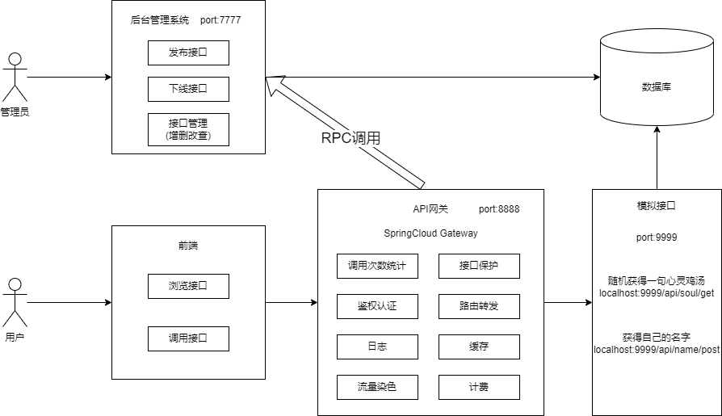

# API接口调用平台

> 个人的API接口调用平台！
>
> SpringBoot + MyBatis-Plus + Gateway 的项目，仅含网站后台的代码。

## 项目背景

个人的API接口调用平台，统一开放接口，避免重复造轮子，让业务更加高效。

## 功能

- 使用SpringBoot + MyBatis-Plus实现后台管理系统
  - 管理员可以发布接口、下线接口、新增接口以及对接口的管理。
  - 普通用户可以注册登录，浏览接口，使用接口。
- 使用SpringCloud的Gateway网关实现如下功能
  - 使用RPC + Dubbo实现对后台管理系统的调用
    - 查询用户是否存在
    - 查询接口是否存在并且是否上线
    - 调用成功后将用户对接口的调用次数加1
  - 对接口进行保护，不能随便调用
  - 对请求进行鉴权认证，只有符合要求的请求才能通过
  - 对请求进行路由转发，保证请求到达正确的服务
  - 对请求加上日志(todo)
  - 对请求的响应结果进行缓存(todo)
  - 给请求加上一些自定义的请求头，实现对请求的染色，保证不是该颜色的请求不能访问服务(todo)
  - 对请求频次高的接口进行收费处理(todo)
- 基于Spring Boot Starter开发了客户端SDK
  - 解决开发者调用成本过高的问题，使用更轻量的代码即可调用接口

## 技术栈

### 后端

+ 主语言：Java
+ 开发框架：SpringBoot + Spring Cloud Gateway + MyBatis-Plus + Dubbo
+ 数据库：MySQL

## 整体架构

仅供参考：

